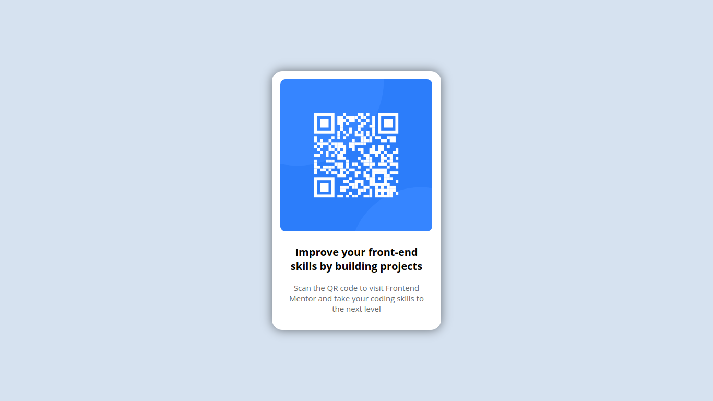

# Frontend Mentor - QR code component solution

This is a solution to the [QR code component challenge on Frontend Mentor](https://www.frontendmentor.io/challenges/qr-code-component-iux_sIO_H). Frontend Mentor challenges help you improve your coding skills by building realistic projects.

## Table of contents

- [Overview](#overview)
  - [Screenshot](#screenshot)
  - [Links](#links)
- [My process](#my-process)
  - [Built with](#built-with)
- [Author](#author)

## Overview

### Screenshot

### Links

- Solution URL: [View Solution Code](https://github.com/50NiC613/frontend-mentor-qr-code)
- Live Site URL: [View live site](https://frontend-mentor-qr-code-nine-alpha.vercel.app/)

## My process

### Built with

- Semantic HTML5 markup
- Sass & CSS custom properties
- Flexbox
- Mobile-first workflow
- [Angular](https://angular.io/) - JS Framework

## Author

- Frontend Mentor - [@50NiC613](https://www.frontendmentor.io/profile/50NiC613)
